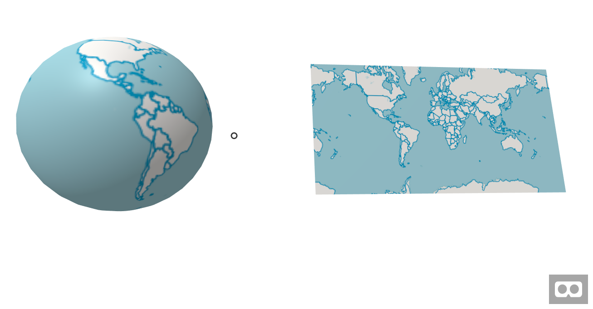
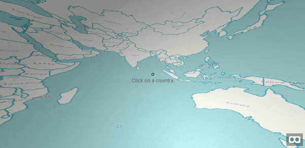

# aframe-openlayers-component

An A-Frame component that allows the use of OpenLayers maps inside A-Frame.

This component allows the use of any OpenLayers map into any A-Frame object. It uses OpenLayers `postcompose` map event to export the map into an image (using canvas) and then the image is added into the A-Frame material. Also, it tries to pass OpenLayers interactions into A-frame to allow selection, pan, move etc. inside the VR environment.

**[Simple example:](https://lcalisto.github.io/aframe-openlayers-component/examples/simple.html)**

[](https://lcalisto.github.io/aframe-openlayers-component/examples/simple.html)


**[Inverted globe example with country selection and minimap.](https://lcalisto.github.io/aframe-openlayers-component/examples/invertedTwoMaps.html)**

[](https://lcalisto.github.io/aframe-openlayers-component/examples/invertedTwoMaps.html)

[More examples ...](#examples)

### Schema

| Property | Description | Default Value | Required |
| -------- | ----------- | ------------- | ---- |
| **map** | Javascript variable name of the OpenLayers map to use. | map | true|
| **pixToVRRatio** | The multiplication factor between meters in A-Frame and the pixels of the map. ie; when set to 100, will display 100 pixels per 1 meter in VR space. Please check [Info about map](#info-about-map) | 100 | true |
| **OlEvent** | OpenLayers event used in the interaction. This event will be passed into aframe. ie; when select is active probably you pass the click event. [More info about OpenLayers interaction events.](https://openlayers.org/en/latest/apidoc/ol.interaction.html) | click | false |
| **aframeEvent** | A-Frame event that will be the destiny for the OLEvent. ie; When select interaction is active probably you pass also the click event. [More info about A-Frame events.](https://aframe.io/docs/0.8.0/introduction/interactions-and-controllers.html#sidebar)  | click | false |
| **width** | Normally map width is computed based on component width. But in some cases you might not give width in the component, ie; when using a radius instead of width and height. In this cases, if width is not provided in the component, you need to provide a width for the map in VR units (meters). Please check [Info about map](#info-about-map) |  | false |
| **height** | Normally map height is computed based on component height. But in some cases you might not give height in the component, ie; when using a radius instead of width and height. In this cases, if height is not provided in the component, you need to provide a height for the map in VR units (meters). Please check [Info about map](#info-about-map)  |  | false |

### Info about map

Map size is computed using the folowing formula: MapWidth = (pixToVRRatio * component width) and MapHeight = (pixToVRRatio * component height) 

The higher `pixToVRRatio`, the more map area will be displayed per VR unit. The canvas has to be translated into a plane in VR space. This is combined with the width and height in VR space (from geometry.width and geometry.height on the entity or in case they don't exist then from the provided width and height in the OL object) to set up the map plane for rendering in 3D.

The map is rendered as a texture on a 3D plane. For best performance, texture sizes should be kept to powers of 2, because of that, the component automatically resizes geometry.width and/or geometry.height to the closest power of 2 using the provided pixToVRRatio. If you don't want the component to automatically resize your objects you should make sure `width * pixToVRRatio` and `height * pixToVRRatio` are powers of 2.

### Installation


#### npm

Via npm:

```bash
npm install aframe
npm install aframe-openlayers-component
```

Then

```js
require('aframe');
require('aframe-openlayers-component');
```

#### Directly including the [minified file](dist)

```html
<html>
  <head>
    <title>A-Frame Openlayers Component - Simple example</title>
    <meta name="description" content="Simple example for OpenLayers component in a flat panel."></meta>
    <!-- Openlayers -->
    <link rel="stylesheet" href="https://openlayers.org/en/v4.6.5/css/ol.css" type="text/css">
    <!-- The line below is only needed for old environments like Internet Explorer and Android 4.x -->
    <script src="https://cdn.polyfill.io/v2/polyfill.min.js?features=requestAnimationFrame,Element.prototype.classList,URL"></script>
    <script src="https://openlayers.org/en/v4.6.5/build/ol-debug.js"></script>
    <!-- A-Frame -->
    <script src="https://aframe.io/releases/0.8.2/aframe.min.js"></script>
    <!-- aframe openlayers component -->
    <script src="https://unpkg.com/aframe-openlayers-component/dist/aframe-openlayers-component.min.js"></script> 
    <!-- your OpenLayers map -->
     <script>
        var source1 = new ol.source.OSM();
        var layer1 = new ol.layer.Tile({
          source: source1
        });
        var source2 = new ol.source.Vector({
            url: 'https://openlayers.org/en/v4.6.5/examples/data/geojson/countries.geojson',
            format: new ol.format.GeoJSON()
        });
        var layer2 = new ol.layer.Vector({
            source: source2
        });
        var map = new ol.Map({
            layers: [
                layer1,
                layer2
            ],
            target: 'map',
            controls: ol.control.defaults({
                attributionOptions: {
                    collapsible: false
                }
            }),
            view: new ol.View({
                center: [0, 0],
                zoom: 0.7
            })
        });
	 </script>
  </head>
  <body>
    <a-scene>
      <a-assets>
          <div id="map"></div>
      </a-assets>
      <a-plane 
        position="0 2 -2" 
        height="2" 
        width="4" 
        color="#c4c4c4"
        ol="  map: map;
              pixToVRRatio:150;"
     ></a-plane>
    </a-scene>
  </body>
</html>
```

### Examples

All examples are in [examples/](examples/) folder.

1. [Simple plane and a globe using the same map.](https://lcalisto.github.io/aframe-openlayers-component/examples/simple.html)

2. [Curved plane.](https://lcalisto.github.io/aframe-openlayers-component/examples/curvedPlane.html)

3. [Two map panels. A big one allowing selection and a small with the selected country.](https://lcalisto.github.io/aframe-openlayers-component/examples/select.html)

4. [Inverted globe with country selection.](https://lcalisto.github.io/aframe-openlayers-component/examples/inverted.html)

5. [Inverted globe with country selection and a centered mini map.](https://lcalisto.github.io/aframe-openlayers-component/examples/invertedTwoMaps.html)


### Notes

* Component based on the idea of Allan Walker from [https://blog.mapbox.com/mapbox-gl-js-ar-js-a-frame-vr-mapbox-ar-vr-93c09be08742](https://blog.mapbox.com/mapbox-gl-js-ar-js-a-frame-vr-mapbox-ar-vr-93c09be08742)

* API had some influences from the [A-Frame Tangram-Component](https://github.com/mattrei/aframe-tangram-component)
